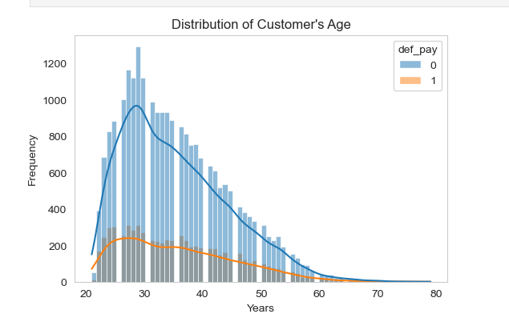
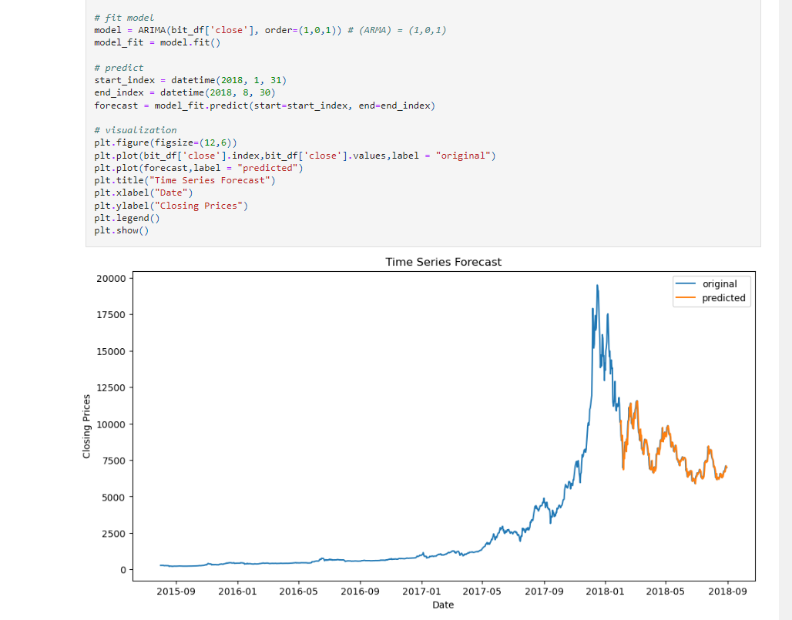
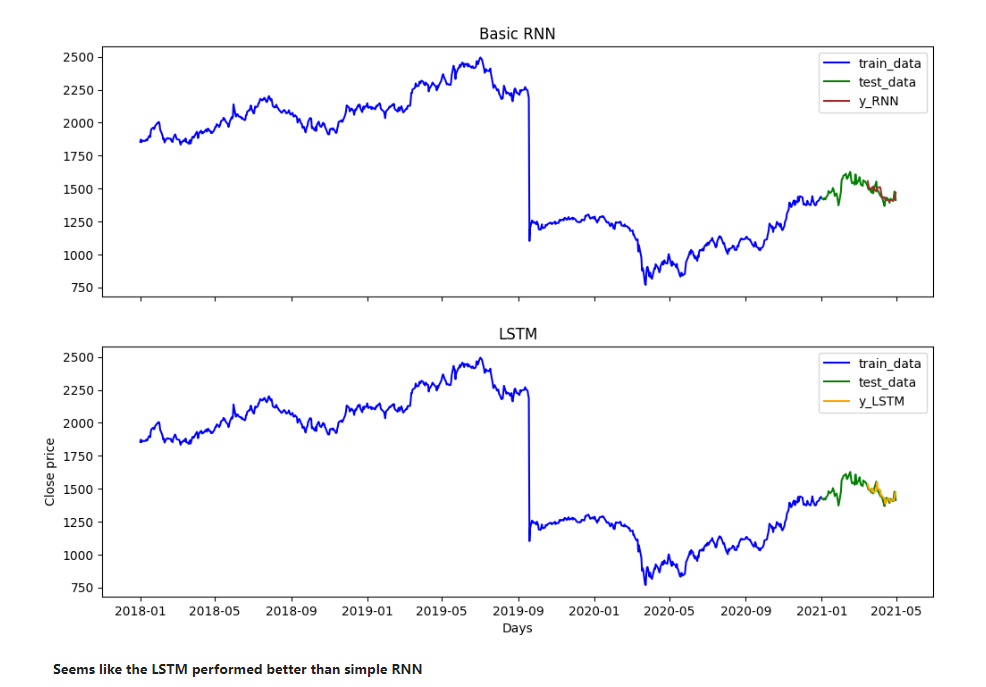
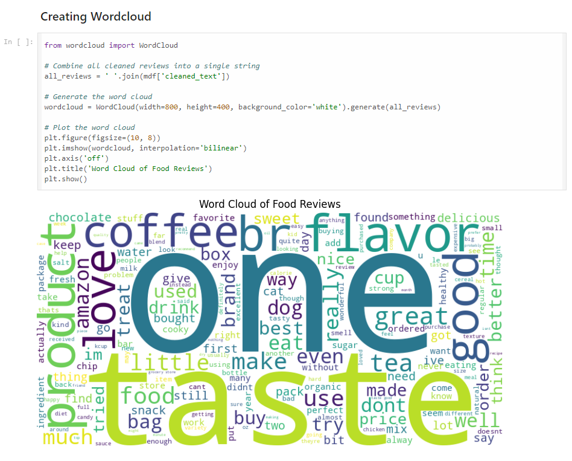
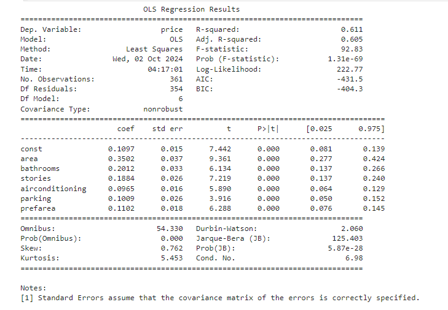

# Introduction
This repository demonstrates different data science projects. 

**Data Visualization -> EDA for UCI Credit Card Payment Default** - This is an example of EDA (Exploratory Data Analysis). We did EDA for a credit card default dataset. We checked for missing values, made graphs to observe the distribution of the target variable, observed the relationships between the independent and dependent variables, and conducted ANOVA test.  

    

**Time Series Analysis -> Bitcoin Price Prediction**: In this Jupyternotebook, we did EDA for a dataset that includes historical Bitcoin prices for a certain period. We used the ARIMA model to predict the future bitcoin prices. 

    

**Time series analysis using Deeplearning** - Application of deep learning models such as RNN(Recurrent Neural Network) and LSTM (Long-Short Term Memory) for stock price prediction. 

    

**Natural Language Processing (Sentiment_Analysis)** - Here, we have used VADER to analyze the sentiment of Amazon product reviews. 

    

**House price prediction using linear regression** - Here, we have used a linear regression model to predict house prices.  

    

